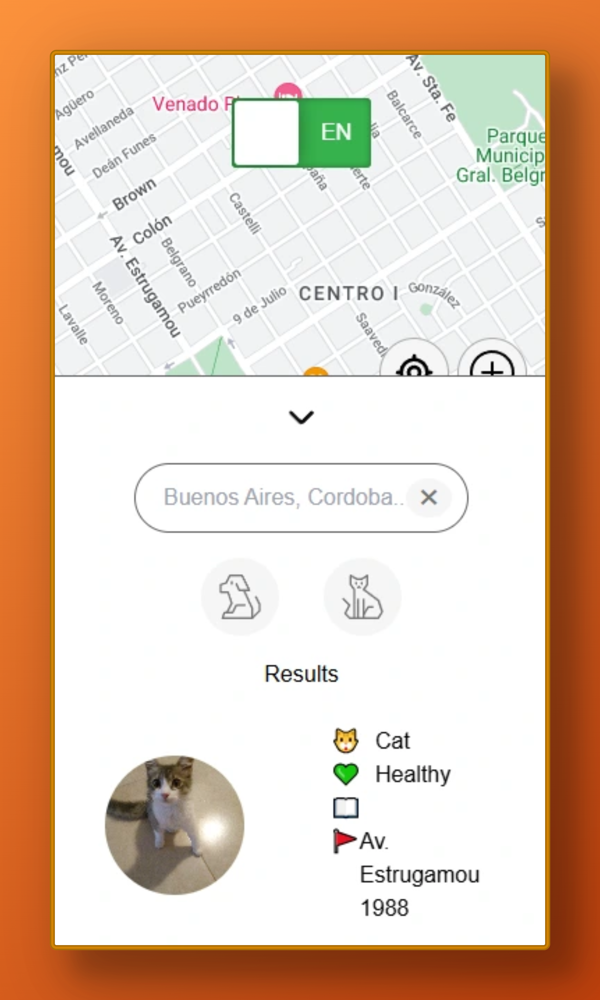

# S.O.S Patas

S.O.S Patas es un sitio web con la propósito de ayudar a ayudarlos. Creemos que todos los animales merecen un hogar, entonces creamos una web para facilitar la tarea a aquellos que piensan lo mismo y están dispuestos a colaborar. Un lugar exclusivo para publicar tu mascota perdida o aquellos animales callejeros que necesitan atención, tan solo ubicalo en el mapa, agrega su información ¡y ya habrá alguien dispuesto a ayudarlo!

[S.O.S Patas | Página Oficial](https://sospatas.com)

### 📸 Capturas

## 🚀 Stack Tecnológico

S.O.S Patas está desarrollado con las siguientes tecnologías:

- **Frontend:** [React](https://react.dev/) con [Vite](https://vitejs.dev/)  
- **Estilos:** CSS Modules  
- **Pruebas:** [Vitest](https://vitest.dev/), [Testing Library](https://testing-library.com/), [Happy DOM](https://happy-dom.js.org/)  
- **Backend:** API alojada en [Render](https://render.com/)  
- **Base de datos:** Turso
- **Autenticación:** Firebase  
- **Mapas:** Google Maps API  

