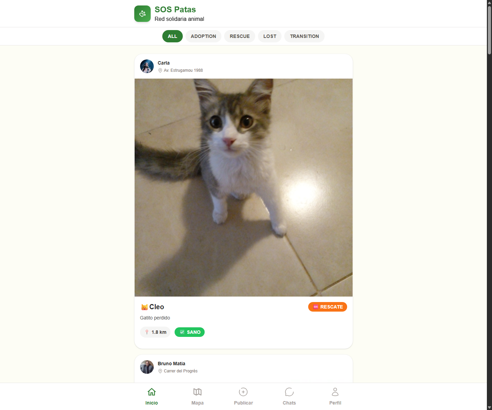
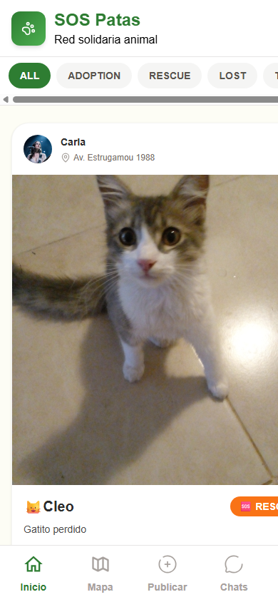
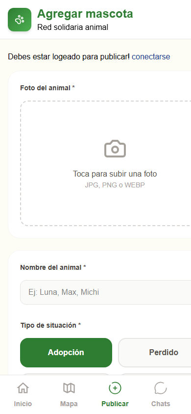

# S.O.S Patas Web App

S.O.S Patas is a web app for reporting lost pets, animals in need of rescue, and pets available for adoption. Users can publish geolocated reports with images, browse nearby cases, and explore animal locations on an interactive map.

This repository contains the frontend application. The REST API and the image-classification package are maintained in separate repositories.

[Live demo](https://www.sospatas.com/)

## Screenshots

### Animal feed



### Mobile experience



### Report form



## Features

- Create animal reports with name, description, status, condition, location, and image.
- Browse reports in a responsive feed with filters by situation.
- View reports on a Google Maps based interface.
- Estimate distance from the user's current location.
- Authenticate users with Firebase Authentication.
- Upload animal images through Cloudinary.
- Consume a separate REST API for animal reports, users, and location-related data.
- Integrate with a companion image-classification package for cat/dog prediction experiments.

## Tech Stack

- React
- TypeScript
- Vite
- Tailwind CSS
- Zustand
- React Router
- Google Maps
- Firebase Authentication
- Cloudinary

## Architecture

This repository contains the frontend client. The app integrates with external services and companion repositories:

- REST API for persistence and business logic
- Firebase Authentication for user login
- Cloudinary for image uploads
- Google Maps and geocoding for location features
- TensorFlow.js image-classification package for animal image validation experiments

## Related Repositories

S.O.S Patas is split into separate repositories:

- Frontend web app: this repository
- REST API: [sospatas-apirest](https://github.com/ArmestoSantiago/sospatas-apirest)
- Image classification package: [image-classification](https://github.com/ArmestoSantiago/image-classification)

## Project Structure

```text
src/
  assets/       Static app content and localized text
  components/   Reusable UI components
  const/        Shared constants
  hooks/        Custom React hooks
  pages/        Route-level screens
  services/     API and third-party service calls
  stores/       Zustand state stores
  types/        TypeScript domain types
  utils/        Shared helpers
  public/
  screenshots/  README screenshots
```

## Getting Started

### Prerequisites

- Node.js 18 or later
- npm
- Firebase project credentials
- Google Maps API key
- Cloudinary account
- S.O.S Patas API URL and API key

### Installation

```bash
npm install
npm run dev
```

Create a `.env` file in the frontend folder with:

```env
VITE_GOOGLE_MAPS_APIKEY=
VITE_GOOGLE_GEOCODE_APIKEY=
VITE_GOOGLE_MAP_ID=
VITE_GOOGLE_GEOCODE_URL=
VITE_FIREBASE_APIKEY=
VITE_AUTH_DOMAIN=
VITE_PROJECT_ID=
VITE_STORAGE_BUCKET=
VITE_MESSAGIN_SENDER_ID=
VITE_APP_ID=
VITE_APISOSPATAS_URL=
VITE_APISOSPATAS_KEY=
VITE_CLOUDINARY_APIKEY=
VITE_CLOUDINARY_NAME=
```

## Available Scripts

```bash
npm run dev
npm run build
npm run preview
npm run lint
npm run test
```

## What I Practiced

- Building a production frontend that communicates with a custom REST API.
- Integrating third-party services in a real user flow.
- Working with geolocation, maps, image uploads, authentication, and remote persistence.
- Modeling shared domain concepts such as animal type, health condition, and report situation.
- Consuming a separately developed TensorFlow.js image-classification package.

## Roadmap

- Add automated tests for the main publishing and filtering flows.
- Improve empty, loading, and error states.
- Add real-time chat between users.
- Add moderation and report review tools.
- Integrate image classification into the publishing flow.
- Improve accessibility and keyboard navigation.

## Author

Developed by Santiago Armesto.

- GitHub: [ArmestoSantiago](https://github.com/ArmestoSantiago)
- Live app: [sospatas.com](https://www.sospatas.com/)
